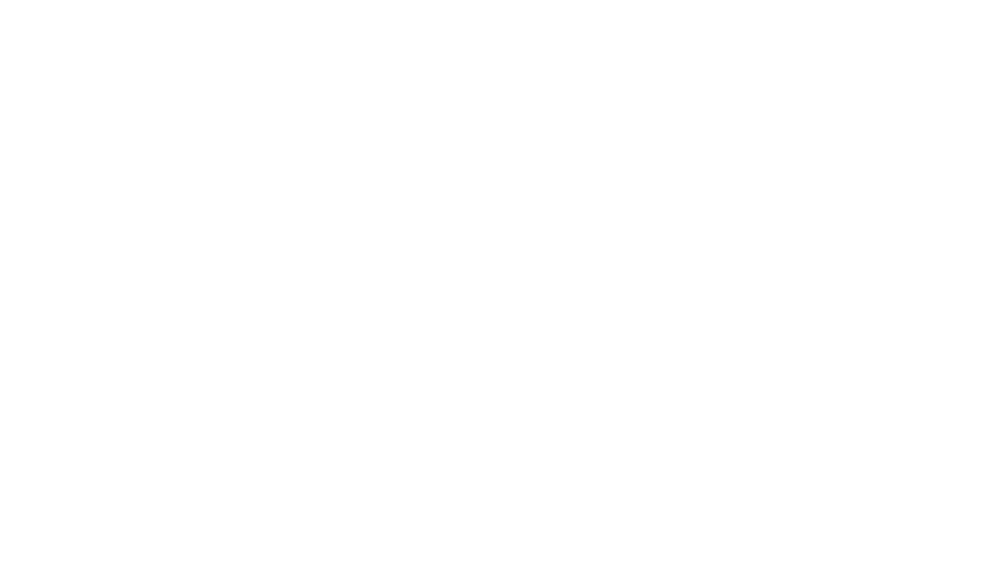
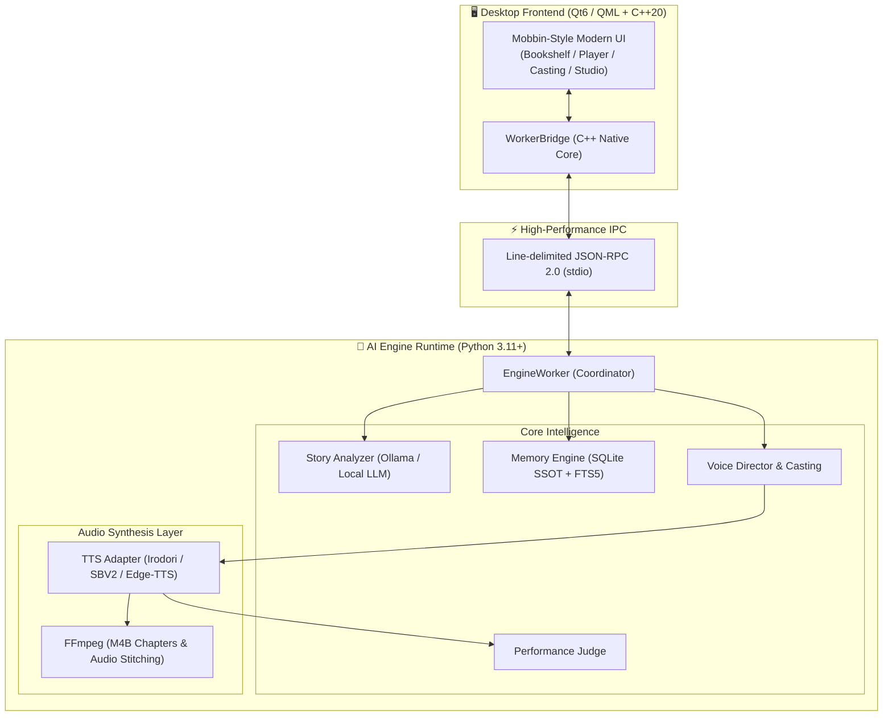

# 🎧 AISAE (AI Story Acting Engine)

<div align="center">

**🌐 [English README (README.md)](README.md)**

<br/>

> **⚠️ 本プロジェクトは現在 Early Preview / デモ段階 です。**  
> デスクトップUI・Pythonエンジンは実際に動作しますが、多くの機能がまだ開発中です。  
> フィードバック・コントリビューション・アイデア、大歓迎です！

<br/>

**Text-to-Speechを超えて：ローカルAIパワードのオーディオドラマ&オーディオブックを、すべての人に。**  
*小説を単に読み上げるのではなく、感情・関係性・心の声を「演じ分ける」、ローカル完結型AIオーディオブック・スタジオ*

[](#-現在のステータス)
[](desktop/)
[](workers/python/)
[-blueviolet.svg)](https://ollama.com/)
[](workers/python/engine/tests/)
[](LICENSE)

<br/>

<!-- スクリーンショット: 実機のビルド後に差し替え -->


<br/><br/>

</div>

---

## 🌟 プロジェクトのビジョン

現代のオーディオブックは制作コストが非常に高く、世の中のほとんどの小説・同人誌・自作短編は「声」を与えられないまま埋もれています。また、一般的なAI読み上げ（TTS）は平坦で無感情なロボット声になりがちで、「物語の世界に没入する」体験には届いていませんでした。

**AISAE (AI Story Acting Engine)** は、**「将来的に誰でも自宅のPC（ローカル環境完結）で、手持ちの小説や物語から映画レベルの本格的な音声ドラマ・オーディオブックを創り、楽しめる世界」** を目指して開発されている次世代オープンソースエンジンです。

- **100% リアルな実機実装**: AI生成された架空のモックアップ画像ではなく、実際に動作するQt6/C++20 & Pythonエンジンによる本物のインターフェース。
- **権利関係に配慮した設計**: 実在声優や有名人のボイスクローンに依存せず、独自の音響アーキタイプ（`Test_Voice / Archetype Presets`）と演技パラメータによってキャラクターの魅力を引き出します。
- **完全ローカル完結可能 & 自由なTTSプラグイン**: VOICEVOX、Ollama、OpenAI互換自作TTS、Kokoro、Edge-TTSなど、お好きなローカルTTS/LLMを自由に設定画面からバインド可能です。

---

## ✨ コア機能

### 1. 📚 スマート本棚 & ドキュメントインポーター
- テキストファイル（`.txt`）やPDF・画像から小説を取り込み、自動で章（チャプター）・登場人物・場面構造を解析。
- 再生進捗・音声生成ステータスを一目で管理。

### 2. 🧠 Character Intelligence（登場人物の記憶と関係性）
- 単なる声の割り当てではなく、**「誰が」「誰に対して」「どんな感情で」**話しているかを追跡。
- **External / Internal デュアルボイス**: 「口に出したセリフ」と「心の中のモノローグ（本音）」で声のトーンやピッチを自動で演じ分けます。
- **感情の余韻 (Emotional Carryover)**: 怒りや悲しみのシーンの後、直ちに平坦に戻るのではなく、感情の残り香が次の発話へと自然に減衰しながら滲み出ます。

### 3. 🎙️ 感情絵文字 (Acting Emojis) × 演技演出
- 「ため息」「照れ」「ツッコミ」「威厳」「囁き」などの感情ニュアンスを、台本上の演技絵文字を通じてTTSモデルに精密注入。
- ピッチ（Pitch）、発話速度（Pace）、声の芯（Energy）を自在にチューニングし、独自のカスタムボイスを永続保存可能。

### 4. ⚖️ Performance Judge（音質ではなく「演技」の審査）
- 合成された音声が「文脈として合っているか」を判定。親友が倒れた悲痛な場面で明るい声になっていないか等を自律検証し、不適切な場合は自動で再演技（Re-perform）を実行。

### 5. 🎧 M4B オーディオブック書き出し
- 生成された音声は章ごとのチャプター目次・メタデータが埋め込まれた標準の `.m4b` 形式でエクスポート可能。Apple Books、Audible、各種オーディオブックプレイヤーでそのまま聴くことができます。

---

## 🏗️ システムアーキテクチャ



---

## 🚀 クイックスタート

### 前提条件
- **OS**: Windows 11 / 10 (64-bit)
- **C++ / Qt ビルド環境**: MSYS2 (MinGW-w64) または Qt 6.5+ (QuickControls2, Multimedia)
- **Python**: 3.11+
- **音声処理**: FFmpeg（PATHに登録されていること）

### 1. リポジトリのクローン
```bash
git clone https://github.com/your-username/AIStoryActingEngine.git
cd AIStoryActingEngine
```

### 2. Python エンジンのセットアップ
```bash
cd workers/python
python -m venv .venv
# Windows
.venv\Scripts\activate
pip install -r requirements.txt -r requirements-dev.txt
```

### 3. テストの実行（全280+テスト検証）
```bash
# プロジェクトルートにて
pytest
```

### 4. デスクトップアプリのビルド & 起動
PowerShellからワンステップでビルドおよび起動が可能です：

```powershell
# デスクトップUIのビルド (Qt6 / Ninja / MinGW)
.\desktop\build.ps1

# アプリケーションの起動
.\run_gui.ps1
```

---

## ⚙️ 環境変数設定

`.env.example` を `.env` にコピーして各項目を設定してください：

```bash
cp .env.example .env
```

| 変数名 | 説明 | 例 |
|---|---|---|
| `GEMINI_API_KEY` | Google Gemini API キー（脚本解析AIに使用） | `AIzaSy...` |
| `GEMINI_MODEL` | Gemini モデル名 | `gemini-2.5-flash` |
| `IRODORI_HOST` | Irodori-TTS サーバーURL | `http://127.0.0.1:8088` |

> **💡 ヒント**: Gemini API キーはデスクトップアプリの **Settings > 脚本・演技指示 AI** セクションからも入力可能です（Google Gemini API を選択時）。

---

## 🎨 声質アーキタイプ一覧

本プロジェクトでは、商標権・パブリシティ権・肖像権および声の利用規約に配慮し、実在の声優名やアニメキャラクター名は一切使用しておりません。  
代わりに、音響特性と役柄に基づいた汎用アーキタイプを提供しています：

| プリセット名 | 声質カテゴリー | 音響特性 / 演出イメージ |
|---|---|---|
| `Test_Voice1` | 無頼・ハスキー青年 | 少しハスキーで乾いた野太い低音、ぶっきらぼうな話し方 |
| `Test_Voice2` | 冷静・知的参謀 | キレのある低音、命令口調、感情の波を抑えたクールな響き |
| `Test_Voice3` | 重厚・歴戦の男 | 腹の底から響く超低音、掠れを含んだ威厳ある語り口 |
| `Test_Voice4` | 皮肉・渋み主人公 | 太く低い男声、気だるげでツッコミ口調、やれやれ感 |
| `Test_Voice5` | 正統派・熱血青年 | 芯の通った爽やかな男性声、ハキハキとした勇敢な響き |
| `Test_Voice6` | 余裕・兄貴肌 | 色気のある落ち着いた青年声、飄々として余裕のある甘い低音 |
| `Test_Voice7` | 癒やし・清楚ヒロイン | 透明感のある甘い少女声、柔らかく癒やされる自然な中高音 |
| `Test_Voice8` | 凛冽・高貴令嬢 | 知的で凛とした令嬢声、澄み渡るシルキーなトーン、丁寧な話し方 |
| `Test_Voice9` | 元気・マスコット妖精 | 愛らしく弾むようなハイトーン、天真爛漫で表情豊かな話し方 |
| `Test_Voice10` | 強がり・ツンデレ少女 | ハリのある高音、少しツンツンした早口、感情豊かな強がり |
| `Test_Voice11` | 爽やか青年 | 自然な地声、親しみやすく丁寧な好青年トーン |

---

## 📋 現在のステータス

> **本プロジェクトは Early Preview / デモ段階です。** アーキテクチャ・エンジンコア・デスクトップUIは実際に動作する実装であり、モックアップではありません。ただし、多くの予定機能がまだ開発中です。

### ✅ 現時点で動作するもの
- Qt6/C++20 デスクトップアプリ（ダークテーマUI: 本棚, プレイヤー, キャスティング, ボイスラボ, 設定, スタジオログ）
- stdio JSON-RPC IPC による Python エンジン連携（物語解析・キャラクター抽出・チャプター分割）
- ボイスプロファイル作成、ピッチ/速度/エネルギーチューニング、プレビュー再生
- キャスティングシステム（キャラクターへの声割り当て & SQLite永続化）
- 感情絵文字駆動の演技パラメータ注入
- Performance Judge（不適切な感情コンテキストの自動再演技）
- M4B オーディオブック書き出し（チャプターマーカー付き）
- Settings画面からのローカルTTS / LLMバインディング
- 281件以上の自動テスト

### 🚧 開発中の機能
- 高度なVRAM管理 & バッチTTS推論最適化
- OCR連携による紙書籍・画像スキャンからの直接取り込み
- モバイルプレイヤー（Flutter）
- コミュニティ機能（ボイスプリセット・辞書の共有）
- ComboBoxのダークテーマスタイリング改善
- 設定のディスク永続化（現在のデモではメモリ上のみ）

---

## 🗺️ ロードマップ

- [x] **Phase 0**: PoC（Python単体でのキャラクター解析と音声合成）
- [x] **Phase 1**: SQLiteによる物語状態・記憶（Memory Engine）の永続化
- [x] **Phase 2**: Character Intelligence & External/Internal デュアルボイス
- [x] **Phase 2.5**: 中断・再開可能なジョブパイプライン（Job System）
- [x] **Phase 3**: Qt6/QML + C++20 による超美麗モダン・デスクトップアプリ
- [x] **Phase 3.5**: 感情絵文字（Acting Emojis）演出 & Performance Judge
- [ ] **Phase 4**: ローカルTTS統合の強化（VRAM自動管理・バッチ推論最適化）
- [ ] **Phase 5**: OCR連携による紙書籍・画像スキャンからの直接取り込み
- [ ] **Phase 6**: モバイルプレイヤー（Flutter製・スマートフォンでの持ち歩き視聴）
- [ ] **Phase 7**: コミュニティ機能（ボイスプリセット・辞書の共有）

---

## 📄 ライセンス & コントリビューション

本プロジェクトは [MIT License](LICENSE) の下で公開されています。  
バグ報告、機能提案、Pull Requestは大歓迎です！

<div align="center">
  <sub>Built with ❤️ by the AISAE Open Source Community</sub>
</div>
