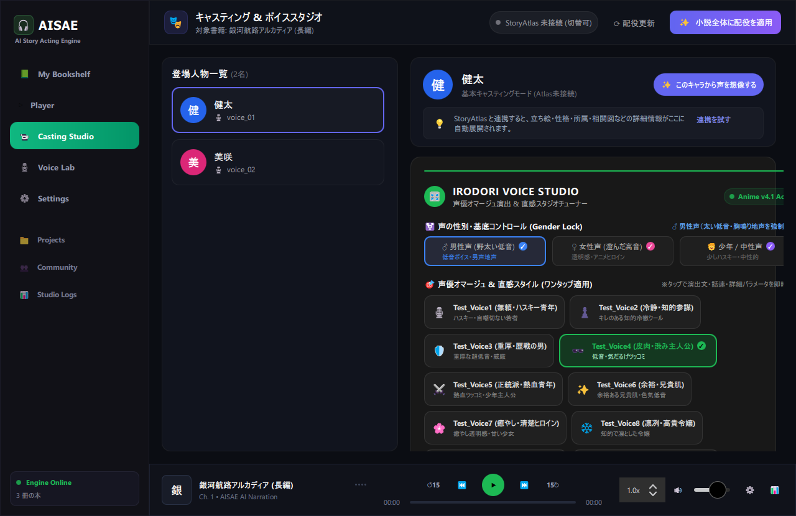
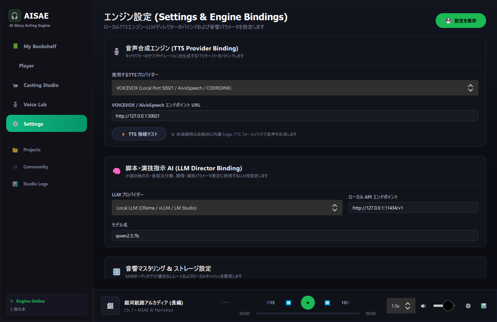
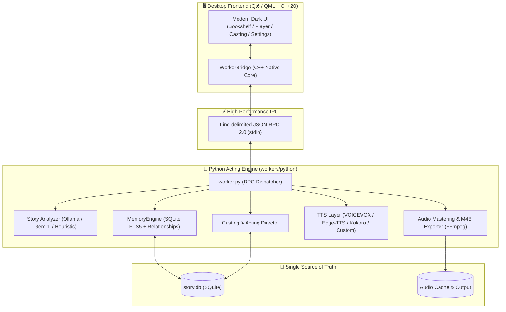

# 🎧 AISAE (AI Story Acting Engine)

<div align="center">

🌐 **English** | [日本語 (Japanese)](README.ja.md)

<br/>

> **⚠️ This project is currently in the Early Preview / Demo stage.**  
> The desktop UI and Python engine are fully functional, but APIs and features are actively evolving.  
> Community contributions, feedback, and ideas are warmly welcome!

<br/>

**Beyond Simple Text-to-Speech: Bringing Local AI-Powered Audio Drama & Audiobooks to Everyone.**  
*An AI-driven audiobook studio that doesn't just read stories, but "acts" them — tracking character emotions, unspoken thoughts, and dramatic relationships completely offline on your PC.*

[](#-current-status)
[](desktop/)
[](workers/python/)
[-blueviolet.svg)](https://ollama.com/)
[](workers/python/engine/tests/)
[](LICENSE)

<br/>


<br/><br/>

</div>

---

## 🌟 Project Vision

Traditional audiobook production is prohibitively expensive, requiring dedicated recording studios, voice directors, sound engineers, and professional voice actors. As a result, countless web novels, indie books, doujin works, and short stories never get voiced.

On the other hand, conventional text-to-speech (TTS) produces flat, emotionless robotic narrations that shatter immersion.

**AISAE (AI Story Acting Engine)** is an open-source engine built with a clear mission:  
**"Empowering anyone to create cinema-grade audio dramas and full-length audiobooks directly on their personal PC, completely offline, powered by local AI."**

- **100% Genuine Native Implementation**: No mockups or AI-hallucinated concept art. All screenshots are from the live Qt6/C++20 desktop application and Python acting engine.
- **Ethical & IP Safe Design**: We strictly avoid unauthorized celebrity voice cloning. AISAE uses generic acoustic archetypes (`Test_Voice1〜8`) and expressive performance vectors to bring characters to life safely.
- **Local-First & Pluggable Architecture**: Easily connect your favorite local TTS servers (VOICEVOX, Ollama, Edge-TTS, Kokoro, or custom OpenAI-compatible TTS) and local/cloud LLMs from the Settings panel.

---

## 📸 Real App Interface & Screenshots

Captured directly from the running Qt6/QML desktop application on Windows.

| 📚 Bookshelf & Studio Player | 🎭 Casting Studio & Voice Director |
| :---: | :---: |
|  |  |

| ⚙️ Settings & Engine Bindings (TTS / Gemini / Ollama) |
| :---: |
|  |

- **Bookshelf & Player**: Sleek dark-mode library, per-chapter seek navigation, and a Spotify-inspired NowPlayingBar featuring a live cava-style reactive waveform indicator that moves only during audio playback.
- **Casting Studio**: Assign voices to detected characters, fine-tune voice acoustic parameters, leverage Gemini AI to "imagine" voice designs from character traits, and use pre-configured safe archetypes (`Test_Voice1〜8`).
- **Settings**: Seamlessly bind VOICEVOX, Ollama, OpenAI-compatible custom TTS endpoints, and safely input Gemini API keys with password-masked input fields.

---

## ✨ Core Features

### 1. 📚 Smart Bookshelf & Document Importer
- Ingest raw novel manuscripts (`.txt`), PDFs, or images.
- Automatically segments text into chapters, scenes, dialogue lines, and narrative exposition.
- Track audio rendering progress and playback states at a glance.

### 2. 🧠 Character Intelligence (Memory & Relationships)
- Tracks not just *what* is said, but **who is speaking, to whom, and under what emotional context**.
- **External vs. Internal Dual-Voice**: Distinctly renders spoken dialogue and internal monologues (unspoken thoughts) using modulated acoustic parameters.
- **Emotional Carryover**: Emotions linger naturally across scene boundaries instead of abruptly resetting to neutral.

### 3. 🎙️ Acting Emojis & Dramatic Nuance Direction
- Subtly guides neural TTS models using scripted acting emojis (`sigh`, `blush`, `whisper`, `tsukkomi`, `anger`, `majesty`).
- Adjust pitch, pace, and vocal energy on the fly, with full persistence to local SQLite storage.

### 4. ⚖️ Performance Judge (Automated Quality Verification)
- An AI judge reviews synthesized lines in narrative context. If a line intended to be grief-stricken is voiced too cheerfully, it triggers an automated re-performance.

### 5. 🎧 Chaptered M4B Audiobook Export
- Exports full production audiobooks in standard `.m4b` format, complete with chapter bookmarks, embedded cover artwork, and rich metadata compatible with Apple Books, Audible, and VLC.

---

## 🏗️ System Architecture



---

## 🚀 Getting Started

### Prerequisites
- **OS**: Windows 11 / 10 (64-bit)
- **C++ / Qt Environment**: MSYS2 (MinGW-w64) with Qt 6.5+ (Quick, QuickControls2, Multimedia)
- **Python**: 3.11+
- **Audio Processing**: FFmpeg (available in system PATH)

### 1. Clone the Repository
```bash
git clone https://github.com/Yato-Works/AIStoryActingEngine.git
cd AIStoryActingEngine
```

### 2. Set Up the Python Engine
```bash
cd workers/python
python -m venv .venv

# On Windows
.venv\Scripts\activate

# Install dependencies
pip install -r requirements.txt -r requirements-dev.txt
cd ../..
```

### 3. Run Automated Tests (280+ tests)
```bash
# Run pytest from the repository root
pytest
```

### 4. Build & Launch the Desktop App
```powershell
# Build the Qt6 desktop application (Ninja / MinGW)
.\desktop\build.ps1

# Launch the application
.\run_gui.ps1
```

---

## 🎨 Preset Voice Archetypes

To ensure full compliance with copyright, publicity rights, and voice actor terms of service, AISAE uses generic acoustic archetypes rather than real voice actor names:

| Preset ID | Category | Acoustic Characteristics / Acting Profile |
|---|---|---|
| `Test_Voice1` | Rogue / Husky Youth | Dry, husky, resonant masculine baritone; blunt delivery |
| `Test_Voice2` | Cool / Tactical Strategist | Crisp, low, authoritative tone; restrained emotional variation |
| `Test_Voice3` | Veteran / Battle-hardened | Deep, chest-resonant bass with subtle gravel and commanding weight |
| `Test_Voice4` | Sarcastic / Gritty Protagonist | Resonant male tone with world-weary sigh and tsukkomi bite |
| `Test_Voice5` | Heroic / Earnest Youth | Clear, bright, brave masculine timbre with energetic articulation |
| `Test_Voice6` | Charismatic / Older Brother | Smooth, suave, mature young male voice with relaxed pacing |
| `Test_Voice7` | Gentle / Pure Heroine | Soft, airy, crystalline female voice with soothing warmth |
| `Test_Voice8` | Noble / Dignified Lady | Refined, poised, silky high-register voice with articulate diction |
| `Test_Voice9` | Playful / Energetic Fairy | Bouncy, expressive high-pitch timbre with innocent cadence |
| `Test_Voice10` | Tsundere / Spirited Girl | Bright, sharp vocal quality with rapid, emotionally reactive pacing |
| `Test_Voice11` | Friendly / Courteous Youth | Natural, approachable everyday male voice with polite inflection |

---

## 📋 Current Status

> **This project is in the Early Preview / Demo stage.** The core architecture, database persistence, and desktop GUI are functional and running locally. However, many production features remain in active development.

### ✅ What Works Today
- **Qt6/C++20 Desktop App**: Dark-themed UI with Bookshelf, Player, Casting Studio, Voice Lab, Settings, and Studio Logs.
- **Python Engine over stdio JSON-RPC**: Story analysis, character extraction, chapter parsing, and memory management.
- **Voice Studio**: Custom voice profile creation, pitch/pace/energy tuning, and live preview playback.
- **Casting System**: Character-to-voice assignment and persistence (SQLite Single Source of Truth).
- **Acting Emojis**: Dynamic emotion nuance injection into synthesis payloads.
- **Performance Judge**: Automated verification and re-performance triggers for out-of-character audio.
- **M4B Export**: Standard audiobook generation with chapter marks.
- **Settings Page**: Configurable TTS bindings (VOICEVOX, Edge-TTS, Custom) and LLM options (Ollama, Gemini API key).
- **Test Suite**: 281 automated tests passing cleanly.

### 🚧 What's in Progress
- Advanced VRAM management and batch TTS inference optimization.
- OCR document scanner for physical book / manga scan import.
- Cross-platform mobile player (Flutter).
- Community voice preset sharing hub.
- Persistent desktop settings save to disk (currently stored in-memory during session).

---

## ⚙️ Environment Configuration

Copy `.env.example` to `.env` to configure optional cloud LLM or custom TTS endpoints:

```bash
cp .env.example .env
```

| Variable | Description | Example |
|---|---|---|
| `GEMINI_API_KEY` | Google Gemini API Key (used for script analysis) | `AIzaSy...` |
| `GEMINI_MODEL` | Gemini Model Name | `gemini-2.5-flash` |
| `IRODORI_HOST` | Custom TTS Server URL | `http://127.0.0.1:8088` |

> **💡 Tip**: You can also enter and manage your Gemini API key directly from the desktop app under **Settings > LLM Director Binding**.

---

## 🗺️ Roadmap

- [x] **Phase 0**: Proof-of-Concept (Python script analysis & standalone TTS)
- [x] **Phase 1**: SQLite Narrative Memory Engine (FTS5 search + state tracking)
- [x] **Phase 2**: Character Intelligence & External/Internal Dual-Voice System
- [x] **Phase 2.5**: Resumable & Cancellable Background Job Pipeline
- [x] **Phase 3**: Qt6/QML + C++20 Native Desktop Application
- [x] **Phase 3.5**: Acting Emojis & Contextual Performance Judge
- [ ] **Phase 4**: Enhanced Local TTS Integration (VRAM optimization & batch generation)
- [ ] **Phase 5**: Optical Character Recognition (OCR) for physical book imports
- [ ] **Phase 6**: Companion Mobile Player (Flutter)
- [ ] **Phase 7**: Community Presets & Pronunciation Dictionary Sharing

---

## 📄 License & Contributing

This project is licensed under the [MIT License](LICENSE).

Contributions, issue reports, feature suggestions, and pull requests are very welcome!

<div align="center">
  <sub>Built with ❤️ by the AISAE Open Source Community</sub>
</div>
